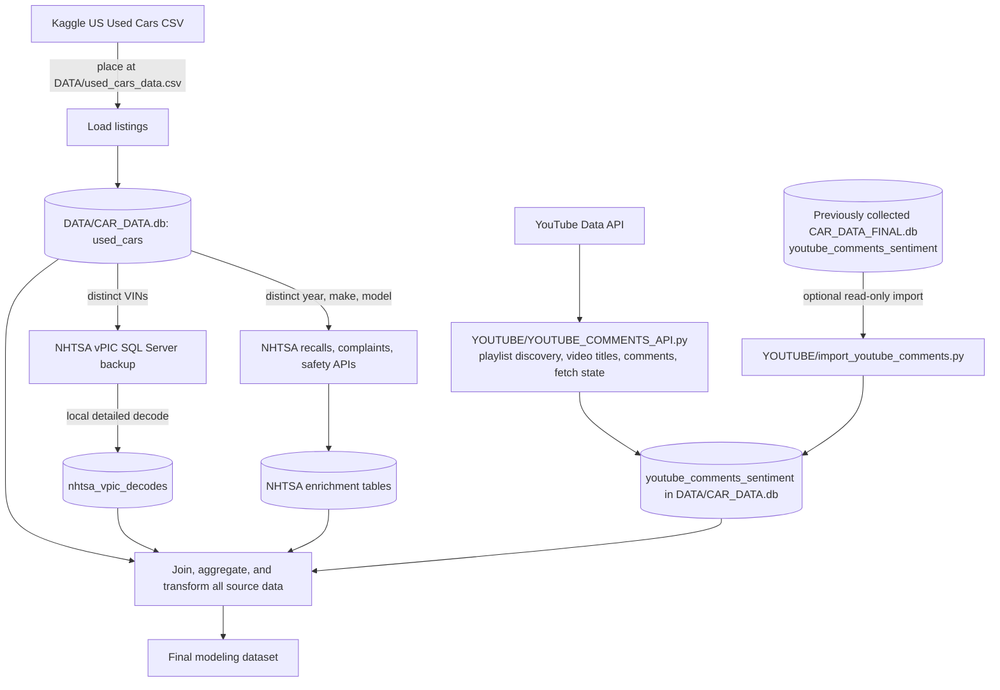

# DataScience Capstone Cars

This repository contains the working files for a car-focused data science capstone. The intended modeling dataset combines used-car listings, NHTSA vPIC decoding, safety ratings, complaints, recalls, and YouTube comments. The project collects or imports those source data, then assembles them into a modeling dataset.

## Repository structure

| Path | Purpose |
| --- | --- |
| `DATA/` | Local source files and generated `CAR_DATA.db`; data files are generally not tracked by Git. |
| `NHTSA/` | Listing ingestion, NHTSA API collection, local vPIC decoding, and the guarded SQL Server restore script. |
| `YOUTUBE/` | YouTube Data API collector and importer for the existing YouTube comment database. |
| `EDA/` | Exploratory analysis notebooks and scripts, including the initial modeling-table loader. |
| `MODELS/` | Model training, evaluation, and saved model workflow files (as added). |
| `README.md` | Project setup, data lineage, and workflow. |
| `DATA_DICTIONARY.md` | Data-specific documentation for the model dataset. |
| `AGENTS.md` | Repository working and documentation-maintenance instructions. |

## Data sources and lineage

| Source | Origin and local input | How it enters the project |
  | --- | --- | --- |
| Used car listings (model dataset) | [US Used Cars Dataset on Kaggle](https://www.kaggle.com/datasets/ananaymital/us-used-cars-dataset); obtain the CSV from the dataset page and place it at `DATA/used_cars_data.csv`. The dataset is described as CarGurus listing data. | `NHTSA/build_car_data_db.py --load-only` streams CSV rows into `used_cars` in `DATA/CAR_DATA.db`; all source columns are retained as text. |
  | NHTSA vPIC VIN decoding | [NHTSA standalone vPIC database downloads](https://vpic.nhtsa.dot.gov/Downloads); the repository restore script is configured for `DATA/vPICList_lite_2026_09.bak`. The downloaded SQL Server backup is VIN-decoding data, not the listings dataset. | Restore as `vPICList_Lite`; the importer reads distinct listing VINs in chunks of up to 100, calls `dbo.spVinDecode` for each VIN with private and all-variable output enabled, and stores all returned variables as columns in `nhtsa_vpic_decodes`; `nhtsa_vpic_variable_metadata` records NHTSA labels, variable IDs, groups, and `DataType`. No vPIC API call is made for this step. |
| NHTSA recalls, complaints, and safety ratings | Live [NHTSA APIs](https://api.nhtsa.gov/), queried from distinct listing model-year/make/model combinations. | Opt-in requests are written to separate enrichment tables in `CAR_DATA.db`; recall and complaint makes/models are checked against NHTSA product catalogs before requests. |
| YouTube comments | The [YouTube Data API](https://developers.google.com/youtube/v3) supplies playlist videos, titles, and top-level comments. `YOUTUBE/YOUTUBE_COMMENTS_API.py` is the project-local collector. A previously collected `youtube_comments_sentiment` table also exists at `E:\Car-Price-Data-Visualization-Learning\CAR_DATA_OUTPUT\CAR_DATA_FINAL.db`. | The collector writes directly to `DATA/CAR_DATA.db`, tracking playlist/video fetch state and refreshing completed videos on its configured schedule. `YOUTUBE/import_youtube_comments.py` remains available to copy the already-existing external table into the project database in read-only source mode. Neither step calculates sentiment scores. |

All six sources contribute to the intended final modeling dataset. The listing CSV is the base; vPIC is associated by VIN, and safety, complaints, and recalls are collected by model year, make, and model. YouTube comments carry video and playlist metadata and must be linked to vehicle/listing records in the final assembly workflow. The final row grain and join/aggregation rules should be recorded when that assembly is implemented. The source fields, grains, and linkage considerations are in [DATA_DICTIONARY.md](DATA_DICTIONARY.md).

## Data workflow



## Setup

The project requires Python. `pyodbc` is used for local vPIC decoding and `google-api-python-client` is used by the YouTube API collector. Configure a YouTube Data API key as `YOUTUBE_API_KEY` or `GOOGLE_API_KEY` in the environment, in the project-root `.env` file, or provide a key file to the script. Install the [Microsoft ODBC Driver for SQL Server](https://learn.microsoft.com/en-us/sql/connect/odbc/download-odbc-driver-for-sql-server) and SQL Server 2019 or newer if using the local vPIC backup.

```powershell
python -m venv .venv
.\.venv\Scripts\python.exe -m pip install -r requirements.txt
```

Download the used-car CSV from Kaggle and save it as `DATA/used_cars_data.csv`. Load it without external queries:

```powershell
.\.venv\Scripts\python.exe NHTSA/build_car_data_db.py --load-only
```

To enable local VIN decoding, download and extract the SQL Server backup from the NHTSA downloads page into `DATA/vPICList_lite_2026_09.bak`, then restore it as `vPICList_Lite`. The guarded restore script only creates the database if it does not already exist. Run it from an Administrator PowerShell session with SQL Server running:

```powershell
Start-Service MSSQLSERVER
& 'C:\Program Files\Microsoft SQL Server\Client SDK\ODBC\170\Tools\Binn\SQLCMD.EXE' -S localhost -E -b -i NHTSA\restore_vpic_database.sql
```

If the SQL Server service account cannot read the backup at that path, move the backup to a readable directory and update the `FROM DISK` path in `NHTSA/restore_vpic_database.sql`. Configure another SQL Server instance or database with `--vpic-server` and `--vpic-database`.

If starting `MSSQLSERVER` reports event 17051, the SQL Server Evaluation period has expired. The original local setup used SQL Server 2019 Enterprise Evaluation. From an Administrator session, run the cached SQL Server setup at `C:\Program Files\Microsoft SQL Server\150\Setup Bootstrap\SQL2019\setup.exe`, choose **Maintenance → Edition Upgrade**, select the `MSSQLSERVER` instance, and change it to Developer edition. If Setup cannot upgrade the expired instance, install a separate SQL Server Developer instance and restore vPIC there.

## Collection commands

Query-only runs leave the listing rows unchanged. With no `--only` option, the importer decodes distinct VINs locally from the already loaded `used_cars` table:

```powershell
.\.venv\Scripts\python.exe NHTSA/build_car_data_db.py
```

Run individual remote NHTSA collections explicitly:

```powershell
.\.venv\Scripts\python.exe NHTSA/build_car_data_db.py --only recalls
.\.venv\Scripts\python.exe NHTSA/build_car_data_db.py --only complaints
.\.venv\Scripts\python.exe NHTSA/build_car_data_db.py --only safety
```

Use `--only all` to collect recalls, complaints, safety ratings, then locally decode VINs. Repeat `--only` flags to select multiple sources, such as `--only recalls --only complaints --only vpic`; these selections run sequentially in one process. Add `--load-listings` only when the CSV should also be loaded or refreshed. Use `--limit 100` for a small trial.

  For a bulk local vPIC run, first load the listings CSV with `--load-only`, then run `./.venv/Scripts/python.exe NHTSA/build_car_data_db.py --only vpic`. The decoder reads distinct non-empty VINs from `used_cars` in chunks. For every VIN it calls NHTSA's detailed `spVinDecode` with `IncludePrivate=1` and `IncludeAll=1`, storing each returned decoder variable as a column in `nhtsa_vpic_decodes`; variable names, NHTSA labels, IDs, groups, and `DataType` are recorded in `nhtsa_vpic_variable_metadata`. NULL values are preserved and do not prove a feature is absent. `--vpic-batch-size 25` reduces transaction chunk size; `--limit 100` caps a trial at 100 distinct VINs. NHTSA's `spVinDecodeMultiple` endpoint is not used for this full-variable path because it returns only summary fields.

Import YouTube comments from the configured source database with:

```powershell
.\.venv\Scripts\python.exe YOUTUBE/import_youtube_comments.py
```

Override the source or destination with `--source` and `--db`. Both scripts write to `DATA/CAR_DATA.db` by default. Large datasets, backups, databases, and model artifacts are local and ignored by Git unless intentionally added.

The API collector can discover its configured playlists and collect comments into the same project database:

```powershell
.\.venv\Scripts\python.exe YOUTUBE/YOUTUBE_COMMENTS_API.py
```

It reads playlist/video/comment limits and refresh options from command-line flags; use `--help` for the full list. Use `--playlist-id` or `--video-id` to target specific content, and `--output-db` to choose another SQLite destination. API collection can consume YouTube quota; fetch status and retry timing are stored so interrupted or rate-limited work can resume.

## Exploratory data analysis

The initial cleaning workflow reads the five modeling tables documented in `DATA_DICTIONARY.md` into Polars DataFrames in batches of 100,000 rows, keeping memory use bounded for the multi-million-row listings table. For `used_cars`, it strips `in`, `gal`, and `seats` suffixes from the configured measurement fields, converts selected numeric fields to Float64 or Int64, and parses `listed_date` as a Date from `YYYY-MM-DD`. Empty or invalid values become NULL; integer-valued decimal strings such as owner count `3.0` become `3`, while fractional counts become NULL. Integer dealer ZIP codes lose leading zeros. Field types and units are documented in `DATA_DICTIONARY.md`. For `nhtsa_vpic_decodes`, it removes `vpic_` from column names and converts the selected numeric columns and `fetched_at` to typed values in memory; it does not change the SQLite database. Run it from the project root after installing requirements:

```powershell
.\.venv\Scripts\python.exe EDA\DATA_CLEANING.py
```

For large databases (such as 20 GB), cleaning uses native Polars expressions within each batch. SQLite row objects are released before cleaning, and processed frames are released before fetching the next batch. Total database size does not determine peak memory; row width and batch size do. Reduce the batch size if needed:

```powershell
python EDA\DATA_CLEANING.py --batch-size 10000
```

When using `load_data()` from another script, process or save each batch before requesting the next one. Accumulating batches with `list(load_data())` or concatenating all frames defeats bounded memory processing. The loader closes its SQLite connection when exhausted or explicitly closed.

## Price modeling scaffold

`MODELS/Price_ML_Models.py` imports the batch loader from `EDA/DATA_CLEANING.py` and defines the requested estimator and randomized-search scaffolding. It intentionally does not choose a target, feature list, joins, sample size, preprocessing, scoring metric, or validation strategy; fill in `prepare_training_data()` and `PARAMETER_DISTRIBUTIONS` after EDA. Running the file only prints this reminder and does not load data or fit models. The `tune_models()` function accepts the finalized training data, preprocessing, scoring metric, and CV splitter.

The scaffold includes LightGBM, XGBoost, Random Forest, Multiple Linear Regression, Lasso, Ridge, and Elastic Net. Search execution is serial by default to reduce memory pressure. Search spaces, scoring, sample limits, preprocessing, and validation folds remain to be chosen after inspecting the data.

References to revisit after EDA include [Bhatt et al. (2023)](https://doi.org/10.1109/gcitc60406.2023.10426270), which compares linear, regularized linear, Random Forest, XGBoost, and LightGBM models for used-car prices; [Fayyaz et al. (2025)](https://doi.org/10.3390/vehicles7030094), which evaluates feature engineering and categorical preprocessing; and [Niu (2025)](https://doi.org/10.54254/2754-1169/2026.nj30803), which describes frequency encoding for high-cardinality fields. LightGBM also documents native categorical support and high-cardinality considerations in its [categorical feature guidance](https://lightgbm.readthedocs.io/en/latest/Advanced-Topics.html#categorical-feature-support). These are background references; encoding and tuning choices are deferred until the project EDA is complete.
