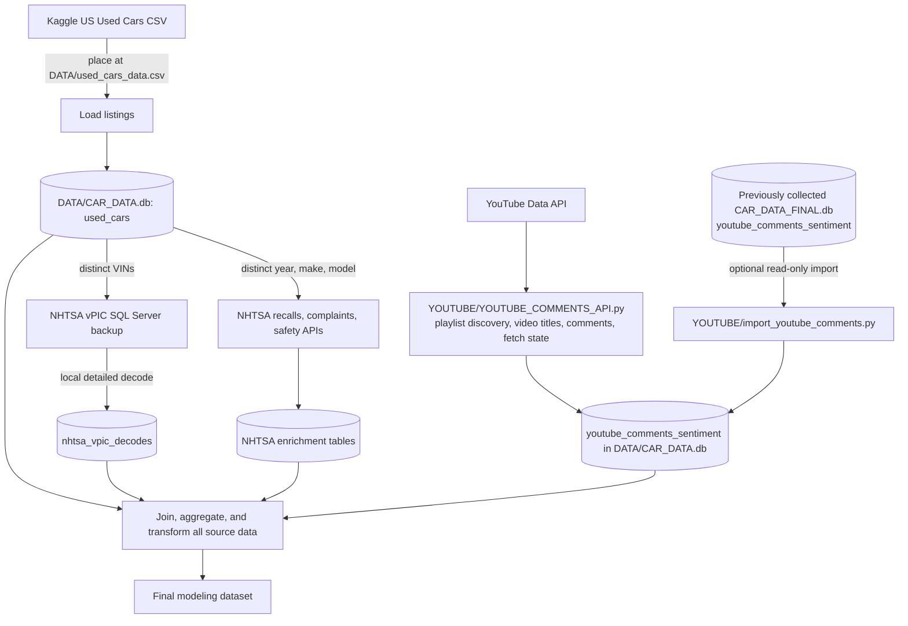

# DataScience Capstone Cars

This repository contains the working files for a car-focused data science capstone. The intended modeling dataset combines used-car listings, NHTSA vPIC decoding, safety ratings, complaints, recalls, and YouTube comments. The project collects or imports those source data, then assembles them into a modeling dataset.

## Repository structure

| Path | Purpose |
| --- | --- |
| `DATA/` | Local source files and generated `CAR_DATA.db`; data files are generally not tracked by Git. |
| `NHTSA/` | Listing ingestion, NHTSA API collection, local vPIC decoding, and the guarded SQL Server restore script. |
| `YOUTUBE/` | YouTube Data API collector and importer for the existing YouTube comment database. |
| `EDA/` | Exploratory analysis notebooks and scripts, including the cleaning and Parquet export script. |
| `MODELS/` | Model training, evaluation, and saved model workflow files (as added). |
| `README.md` | Project setup, data lineage, and workflow. |
| `DATA_DICTIONARY.md` | Data-specific documentation for the model dataset. |
| `AGENTS.md` | Repository working and documentation-maintenance instructions. |

## Data sources and lineage

| Source | Origin and local input | How it enters the project |
  | --- | --- | --- |
| Used car listings (model dataset) | [US Used Cars Dataset on Kaggle](https://www.kaggle.com/datasets/ananaymital/us-used-cars-dataset); obtain the CSV from the dataset page and place it at `DATA/used_cars_data.csv`. The dataset is described as CarGurus listing data. | `NHTSA/build_car_data_db.py --load-only` streams CSV rows into `used_cars` in `DATA/CAR_DATA.db`; all source columns are retained as text. |
  | NHTSA vPIC VIN decoding | [NHTSA standalone vPIC database downloads](https://vpic.nhtsa.dot.gov/Downloads); the repository restore script is configured for `DATA/vPICList_lite_2026_09.bak`. The downloaded SQL Server backup is VIN-decoding data, not the listings dataset. | Restore as `vPICList_Lite`; the importer reads distinct listing VINs in chunks of up to 100, calls `dbo.spVinDecode` for each VIN with private and all-variable output enabled, and stores all returned variables as columns in `nhtsa_vpic_decodes`; `nhtsa_vpic_variable_metadata` records NHTSA labels, variable IDs, groups, and `DataType`. No vPIC API call is made for this step. |
| NHTSA recalls, complaints, and safety ratings | Live [NHTSA APIs](https://api.nhtsa.gov/), queried from distinct listing model-year/make/model combinations. | Opt-in requests are written to separate enrichment tables in `CAR_DATA.db`; recall and complaint makes/models are checked against NHTSA product catalogs before requests. |
| YouTube comments | The [YouTube Data API](https://developers.google.com/youtube/v3) supplies playlist videos, titles, and top-level comments. `YOUTUBE/YOUTUBE_COMMENTS_API.py` is the project-local collector. A previously collected `youtube_comments_sentiment` table also exists at `E:\Car-Price-Data-Visualization-Learning\CAR_DATA_OUTPUT\CAR_DATA_FINAL.db`. | The collector writes directly to `DATA/CAR_DATA.db`, tracking playlist/video fetch state and refreshing completed videos on its configured schedule. `YOUTUBE/import_youtube_comments.py` remains available to copy the already-existing external table into the project database in read-only source mode. Neither step calculates sentiment scores. |

All six sources contribute to the intended final modeling dataset. The listing CSV is the base; vPIC is associated by VIN, and safety, complaints, and recalls are collected by model year, make, and model. YouTube comments carry video and playlist metadata and must be linked to vehicle/listing records in the final assembly workflow. The final row grain and join/aggregation rules should be recorded when that assembly is implemented. The source fields, grains, and linkage considerations are in [DATA_DICTIONARY.md](DATA_DICTIONARY.md).

## Data workflow


```mermaid
flowchart TD
    K[Kaggle US Used Cars CSV] -->|place at DATA/used_cars_data.csv| L[Load listings]
    L --> DB[(DATA/CAR_DATA.db: used_cars)]
    DB -->|distinct VINs| V[NHTSA vPIC SQL Server backup]
      V -->|local detailed decode| VPIC[(nhtsa_vpic_decodes)]
    DB -->|distinct year, make, model| API[NHTSA recalls, complaints, safety APIs]
    API --> AUX[(NHTSA enrichment tables)]
    YAPI[YouTube Data API] --> COLLECT[YOUTUBE/YOUTUBE_COMMENTS_API.py<br/>playlist discovery, video titles, comments, fetch state]
    COLLECT --> YC[(youtube_comments_sentiment in DATA/CAR_DATA.db)]
    EXT[(Previously collected CAR_DATA_FINAL.db<br/>youtube_comments_sentiment)] -->|optional read-only import| IMPORT[YOUTUBE/import_youtube_comments.py]
    IMPORT --> YC
    DB --> ASSEMBLY[Join, aggregate, and transform all source data]
    VPIC --> ASSEMBLY
    AUX --> ASSEMBLY
    YC --> ASSEMBLY
    ASSEMBLY --> M[Final modeling dataset]
```

## Setup

The project requires Python. `pyodbc` is used for local vPIC decoding and `google-api-python-client` is used by the YouTube API collector. Configure a YouTube Data API key as `YOUTUBE_API_KEY` or `GOOGLE_API_KEY` in the environment, in the project-root `.env` file, or provide a key file to the script. Install the [Microsoft ODBC Driver for SQL Server](https://learn.microsoft.com/en-us/sql/connect/odbc/download-odbc-driver-for-sql-server) and SQL Server 2019 or newer if using the local vPIC backup.

```powershell
python -m venv .venv
.\.venv\Scripts\python.exe -m pip install -r requirements.txt
```

Download the used-car CSV from Kaggle and save it as `DATA/used_cars_data.csv`. Load it without external queries:

```powershell
.\.venv\Scripts\python.exe NHTSA/build_car_data_db.py --load-only
```

To enable local VIN decoding, download and extract the SQL Server backup from the NHTSA downloads page into `DATA/vPICList_lite_2026_09.bak`, then restore it as `vPICList_Lite`. The guarded restore script only creates the database if it does not already exist. Run it from an Administrator PowerShell session with SQL Server running:

```powershell
Start-Service MSSQLSERVER
& 'C:\Program Files\Microsoft SQL Server\Client SDK\ODBC\170\Tools\Binn\SQLCMD.EXE' -S localhost -E -b -i NHTSA\restore_vpic_database.sql
```

If the SQL Server service account cannot read the backup at that path, move the backup to a readable directory and update the `FROM DISK` path in `NHTSA/restore_vpic_database.sql`. Configure another SQL Server instance or database with `--vpic-server` and `--vpic-database`.

If starting `MSSQLSERVER` reports event 17051, the SQL Server Evaluation period has expired. The original local setup used SQL Server 2019 Enterprise Evaluation. From an Administrator session, run the cached SQL Server setup at `C:\Program Files\Microsoft SQL Server\150\Setup Bootstrap\SQL2019\setup.exe`, choose **Maintenance → Edition Upgrade**, select the `MSSQLSERVER` instance, and change it to Developer edition. If Setup cannot upgrade the expired instance, install a separate SQL Server Developer instance and restore vPIC there.

## Collection commands

Query-only runs leave the listing rows unchanged. With no `--only` option, the importer decodes distinct VINs locally from the already loaded `used_cars` table:

```powershell
.\.venv\Scripts\python.exe NHTSA/build_car_data_db.py
```

Run individual remote NHTSA collections explicitly:

```powershell
.\.venv\Scripts\python.exe NHTSA/build_car_data_db.py --only recalls
.\.venv\Scripts\python.exe NHTSA/build_car_data_db.py --only complaints
.\.venv\Scripts\python.exe NHTSA/build_car_data_db.py --only safety
```

Use `--only all` to collect recalls, complaints, safety variants and rating details, then locally decode VINs. Repeat `--only` flags to select multiple sources, such as `--only recalls --only complaints --only vpic`; these selections run sequentially in one process. Add `--load-listings` only when the CSV should also be loaded or refreshed. Use `--limit 100` for a small trial.

  For a bulk local vPIC run, first load the listings CSV with `--load-only`, then run `./.venv/Scripts/python.exe NHTSA/build_car_data_db.py --only vpic`. The decoder reads distinct non-empty VINs from `used_cars` in chunks. For every VIN it calls NHTSA's detailed `spVinDecode` with `IncludePrivate=1` and `IncludeAll=1`, storing each returned decoder variable as a column in `nhtsa_vpic_decodes`; variable names, NHTSA labels, IDs, groups, and `DataType` are recorded in `nhtsa_vpic_variable_metadata`. NULL values are preserved and do not prove a feature is absent. `--vpic-batch-size 25` reduces transaction chunk size; `--limit 100` caps a trial at 100 distinct VINs. NHTSA's `spVinDecodeMultiple` endpoint is not used for this full-variable path because it returns only summary fields.

Import YouTube comments from the configured source database with:

```powershell
.\.venv\Scripts\python.exe YOUTUBE/import_youtube_comments.py
```

Override the source or destination with `--source` and `--db`. Both scripts write to `DATA/CAR_DATA.db` by default. Large datasets, backups, databases, and model artifacts are local and ignored by Git unless intentionally added.

The API collector can discover its configured playlists and collect comments into the same project database:

```powershell
.\.venv\Scripts\python.exe YOUTUBE/YOUTUBE_COMMENTS_API.py
```

It reads playlist/video/comment limits and refresh options from command-line flags; use `--help` for the full list. Use `--playlist-id` or `--video-id` to target specific content, and `--output-db` to choose another SQLite destination. API collection can consume YouTube quota; fetch status and retry timing are stored so interrupted or rate-limited work can resume.

## Exploratory data analysis

`EDA/DATA_CLEANING.py` prepares six reusable Parquet files from read-only `DATA/CAR_DATA.db`, under `DATA/CAR_DATA_FINAL/`:

| SQLite table | Output file | Preparation |
|---|---|---|
| `used_cars` | `used_cars.parquet` | Requested listing units and numeric/date types. |
| `nhtsa_vpic_decodes` | `NHTSA_vPIC.parquet` | Remove `vpic_`; apply requested integer/float types. |
| `nhtsa_complaints` | `NHTSA_Complaints.parquet` | Integer `model_year`; expand top-level JSON keys and omit raw `record_json`. |
| `nhtsa_recalls` | `NHTSA_Recalls.parquet` | Integer `model_year`; expand top-level JSON keys and omit raw `record_json`. |
| `nhtsa_safety_rating_values` | `NHTSA_Safety.parquet` | One row per `(query_id, vehicle_id)`, with `field_name` values as columns. |
| `youtube_comments_sentiment` | `Youtube_Comments.parquet` | Imported YouTube comments and metadata, preserved as source columns. |

The accompanying `manifest.json` records source/output row counts, schemas, sizes, JSON key-to-column mappings, and new nulls caused by numeric/date conversion. [DATA_DICTIONARY.md](DATA_DICTIONARY.md) documents the saved schemas, combined missing-value counts using field-specific rules, up to five distinct non-missing examples, and semantic variable classifications. These profiling rules do not modify the saved data; after refreshing the Parquet output, regenerate the dictionary profile to match its new schema.

The listing transformation applies the requested 16 Float64, six Int64, and one Date columns documented in [DATA_DICTIONARY.md](DATA_DICTIONARY.md). It removes trailing `in`/`gal` from the designated measurements, trims surrounding whitespace in transformed fields, and rounds fractional integers to nearest with ties away from zero (`2.5` → `3`). `dealer_zip` is now an integer, so leading zeros disappear. Missing, invalid, non-finite, and out-of-range numeric inputs become null; invalid dates become null. Configured exclusions are omitted from exported Parquet, while the source SQLite values remain available.

Install the project requirements first (the export uses Polars and PyArrow). When ready, run:

```powershell
.\.venv\Scripts\python.exe EDA\DATA_CLEANING.py
```

The exporter fetches at most 100,000 rows per batch and writes compressed Parquet row groups without accumulating the dataset. Complaint/recall JSON keys and types are discovered across the full source before writing, then the source `record_json` field is removed. The configured column exclusions are applied to every exported table after its transformations. Safety is grouped in SQLite before fetching wide rows, so a variant is never split across output rows because of batching. Lower the batch size to reduce memory pressure:

```powershell
.\.venv\Scripts\python.exe EDA\DATA_CLEANING.py --batch-size 10000
```

Files are staged and the output directory is published only after all selected exports succeed and row counts match the expected output grain. Each run replaces the existing output directory with the newly generated dataset, so rerunning the command refreshes Parquet files instead of appending rows. `--output-dir` selects another output location and `--database` selects another source database. All six tables export by default; repeat `--table` to select a subset.

vPIC uses the same nullable numeric parsing and integer rounding policy as listings. The existing schema names are `BedLengthIN`, `ChargerPowerKW`, `DisplacementCI`, and `EngineHP`. Its timestamp retains the whole-table parse guard. Other unrequested fields remain unchanged.

Complaint/recall expansion creates columns for top-level JSON keys and then drops `record_json` from the exported Parquet. Native JSON booleans and consistent numbers retain their types; strings remain strings. Nested arrays/objects (such as complaint `products`) remain JSON text in one column. Missing keys/JSON null become null. A key colliding with a source column gets a collision-safe `json_` prefix. Malformed JSON stops the export rather than silently dropping records. The data dictionary lists the known keys for review; future keys are discovered automatically.

Safety columns keep their original text values, including numeric-looking ratings, `Not Rated`, blanks, and whitespace. Missing fields become null. Duplicate `(query_id, vehicle_id, field_name)` entries stop export rather than selecting or averaging a value. No joins between tables, complaint/recall aggregation, imputation, feature selection, or training is performed.

Models read saved data as Polars, without rerunning SQLite cleaning:

```python
from EDA.DATA_CLEANING import scan_final_table, load_final_data

# Lazy scan: select the features needed before collecting data into memory.
listings = scan_final_table("used_cars")
features = listings.select("vin", "price", "year", "mileage")
complaints = scan_final_table("nhtsa_complaints")
safety = scan_final_table("nhtsa_safety_rating_values")

# Alternatively, process saved data in bounded Polars batches.
for table_name, batch in load_final_data():
    print(table_name, batch.shape)
    del batch
```

Both saved-data helpers default to `DATA/CAR_DATA_FINAL`; pass `dataset_path` for another snapshot. `load_final_data()` defaults to all six files; pass `table_names=("used_cars",)` to read listings alone. Helpers use SQLite table names and map them to the output filenames above. `load_data()` remains available to inspect transformed source batches from SQLite, but is not the modeling input. Accumulating batches or calling `.collect()` on every column loads the requested data into RAM.

Verify transformations, JSON expansion, safety pivoting, source preservation, stable Parquet schemas, and saved-data loading with temporary fixture databases:

```powershell
.\.venv\Scripts\python.exe -m unittest discover -s EDA -p "test_*.py"
```

Safety collection follows [NHTSA’s two-stage API workflow](https://www.nhtsa.gov/nhtsa-datasets-and-apis): discover variants by year/make/model, then request `/SafetyRatings/VehicleId/{id}` for each variant. Every returned detail field is added to `nhtsa_safety_rating_values` under the existing `(query_id, vehicle_id, field_name)` key. Discovery `VehicleId` and `VehicleDescription` values remain intact. The importer retains NULLs, empty strings, whitespace, and statuses such as `Not Rated`; it does not calculate, impute, or combine ratings.

Run only safety collection/backfill from the project root:

```powershell
.\.venv\Scripts\python.exe NHTSA\build_car_data_db.py --only safety
```

This command reuses successful stored discovery results and backfills rating details for existing variant IDs. Per-variant response JSON and `success`, `no_results`, or `error` status are stored in the auxiliary `nhtsa_safety_rating_fetches` table. Completed responses are reused across queries and later runs, failed details are retried on the next run, and a failure preserves previously stored safety fields. Discovery status in `nhtsa_queries` describes the discovery request separately from detail status. Interrupting and repeating the same command resumes completed work. `--delay` applies to each actual safety API request.

To deliberately refresh successful discovery and detail responses later, add `--refresh-safety`. Refresh keeps existing discovery identities and variant links, adds newly discovered links, and updates returned detail fields on success; it does not delete older links/fields if the source stops returning them. Check fetch status/time before treating retained fields as current. Use `--limit 100` for a trial of the first 100 listing year/make/model identities (including cached or empty discovery results).

Verify the safety request, output, caching, and failure handling with:

```powershell
.\.venv\Scripts\python.exe -m unittest discover -s NHTSA -p "test_*.py"
```

The dictionary now profiles the saved `NHTSA_Safety.parquet`: 8,144 query/variant rows and 35 columns. Refresh the Parquet export and dictionary after later collection or transformation changes. Multiple variants remain separate; select the appropriate variant before joining ratings to a listing.

## Price modeling scaffold

`MODELS/Price_ML_Models.py` imports `load_final_data()` and `scan_final_table()` from `EDA/DATA_CLEANING.py` to consume the saved Parquet snapshot as Polars data, and defines the requested estimator and randomized-search scaffolding. It intentionally does not choose a target, feature list, joins, sample size, preprocessing, scoring metric, or validation strategy; fill in `prepare_training_data()` and `PARAMETER_DISTRIBUTIONS` after EDA. Running the file only prints this reminder and does not load data or fit models. The `tune_models()` function accepts the finalized training data, preprocessing, scoring metric, and CV splitter.

The scaffold includes LightGBM, XGBoost, Random Forest, Multiple Linear Regression, Lasso, Ridge, and Elastic Net. Search execution is serial by default to reduce memory pressure. Search spaces, scoring, sample limits, preprocessing, and validation folds remain to be chosen after inspecting the data.

References to revisit after EDA include [Bhatt et al. (2023)](https://doi.org/10.1109/gcitc60406.2023.10426270), which compares linear, regularized linear, Random Forest, XGBoost, and LightGBM models for used-car prices; [Fayyaz et al. (2025)](https://doi.org/10.3390/vehicles7030094), which evaluates feature engineering and categorical preprocessing; and [Niu (2025)](https://doi.org/10.54254/2754-1169/2026.nj30803), which describes frequency encoding for high-cardinality fields. LightGBM also documents native categorical support and high-cardinality considerations in its [categorical feature guidance](https://lightgbm.readthedocs.io/en/latest/Advanced-Topics.html#categorical-feature-support). These are background references; encoding and tuning choices are deferred until the project EDA is complete.
