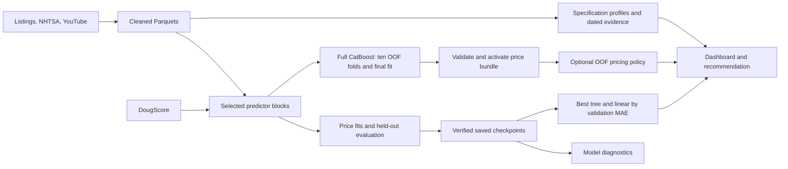
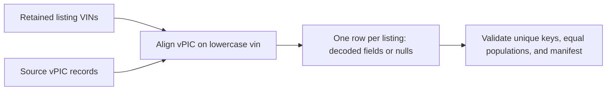
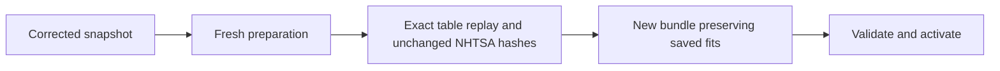
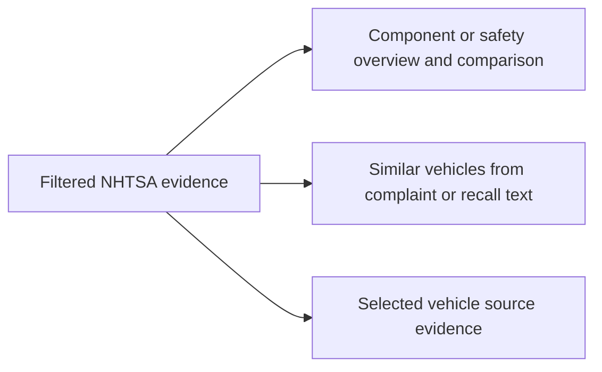
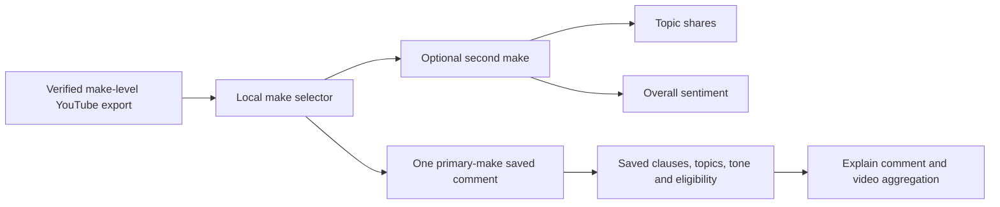
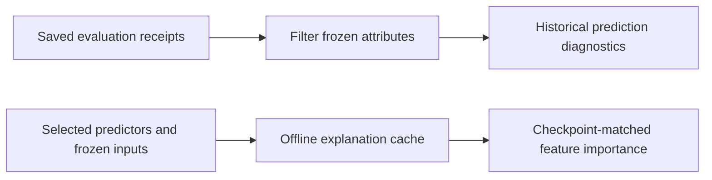

# DataScience Capstone Cars

Predict historical advertised vehicle prices and explore similar vehicles using listing attributes, NHTSA data, YouTube opinions, and DougScore expert reviews. Saved price and discovery artifacts support a local Streamlit recommendation app.

## Project files and sources

| Path | Purpose |
| --- | --- |
| `DATA/` | Listing CSV, vPIC backup, SQLite database, and six-table Parquet snapshot in `CAR_DATA_FINAL/`. |
| `NHTSA/`, `YOUTUBE/`, `EXPERT_REVIEWS/` | Source collection, text processing, and expert-feature generation. |
| `EDA/` | Cleaning, cohort review, export, and exploratory analysis. |
| `MODELS/` | Price training, diagnostics, vehicle profiles, and similarity research. |
| `app.py`, `app_pages/`, `car_app/` | Local Streamlit dashboard and deterministic recommendation search. |
| `MODEL_OUTPUT/`, `MODEL_OUTPUT.ipynb` | Versioned model artifacts, evaluation receipts, and results review. |
| [DATA_DICTIONARY.md](DATA_DICTIONARY.md) | Selected dataset schemas, profiles, transformations, and predictor definitions. |

| Source | Input or collection |
| --- | --- |
| [Kaggle US Used Cars](https://www.kaggle.com/datasets/ananaymital/us-used-cars-dataset) | `DATA/used_cars_data.csv`; includes new and used listings. |
| [NHTSA vPIC](https://vpic.nhtsa.dot.gov/Downloads) | `DATA/vPICList_lite_2026_09.bak`, restored as SQL Server database `vPICList_Lite`. |
| [NHTSA APIs](https://api.nhtsa.gov/) | Recalls, complaints, and safety ratings. |
| [YouTube Data API](https://developers.google.com/youtube/v3) | Video metadata and top-level comments. |
| [DougScore](https://www.dougdemuro.com/dougscore) | Imported expert-review snapshot under `EXPERT_REVIEWS/outputs/`. |

## Workflow

<!-- mermaid:id=car_workflow -->

```mermaid
flowchart LR
  S["Listings, NHTSA, YouTube"] --> P["Cleaned Parquets"]
  P --> F["Selected predictor blocks"]
  E["DougScore"] --> F
  F --> M["Price fits and held-out evaluation"]
  P --> V["Specification profiles and dated evidence"]
  M --> C["Verified saved checkpoints"]
  C --> G["Model diagnostics"]
  F --> O["Full CatBoost: ten OOF folds and final fit"]
  O --> B["Validate and activate price bundle"]
  B --> Q["Optional OOF pricing policy"]
  Q --> A
  C --> T["Best tree and linear by validation MAE"]
  T --> A["Dashboard and recommendation"]
  V --> A
```

## Setup and data preparation

Run PowerShell commands from the repository root. Large data, model outputs, environments, credentials, and browser receipts are ignored by Git. Keep saved run logs and manifests for reproducibility; Python caches and `.playwright-cli/` are disposable.

```powershell
python -m venv .venv
.\.venv\Scripts\python.exe -m pip install -r requirements.txt -r requirements-app.txt
```

Collection needs the listing CSV, SQL Server 2019+, and the Microsoft ODBC Driver. Restore the vPIC backup using [restore_vpic_database.sql](NHTSA/restore_vpic_database.sql), adjusting paths and instance first:

```powershell
.\.venv\Scripts\python.exe NHTSA/build_car_data_db.py --load-only
.\.venv\Scripts\python.exe NHTSA/build_car_data_db.py --only all
.\.venv\Scripts\python.exe YOUTUBE/YOUTUBE_COMMENTS_API.py
```

`--load-only` replaces listing rows; other collection resumes saved work. `--only vpic`, `recalls`, `complaints`, or `safety` limits NHTSA collection. YouTube uses `YOUTUBE_API_KEY` or `GOOGLE_API_KEY` from the environment or ignored root `.env` and consumes quota.

Export and profile the selected six tables:

```powershell
.\.venv\Scripts\python.exe EDA/DATA_CLEANING.py
.\.venv\Scripts\python.exe EDA/profile_data_dictionary.py
```

The exporter applies shared eligibility exclusions, aligns vPIC to one row per retained lowercase `vin`, validates the replacement snapshot, and writes `manifest.json`; SQLite stays read-only. Missing decodes retain null source fields, and duplicate retained decode keys abort publication. Export vPIC together with listings. To align an existing snapshot without re-exporting its other tables, run `.\.venv\Scripts\python.exe EDA/DATA_CLEANING.py --align-vpic-only`; this saves a rollback copy and records matched/missing counts in the manifest. Review cohort outliers with `MODELS/cohort_price_mileage_review.py` and source integrity with `MODELS/price_data_diagnostics.py`. Exact fields and eligibility rules belong in the [dictionary](DATA_DICTIONARY.md#data-rules).


```mermaid
flowchart LR
  L[Retained listing VINs] --> A[Align vPIC on lowercase vin]
  V[Source vPIC records] --> A
  A --> P[One row per listing: decoded fields or nulls]
  P --> C[Validate unique keys, equal populations, and manifest]
```

`EDA/price_mileage_plotly.py` exports full-population histograms and boxplots of `ln(1 + price)` and `ln(1 + mileage)` for the presentation's price and mileage slide, with HTML, PNG, and summary receipts under `outputs/slide13_update/charts/`. Logs compress the right tails and retain zeros. PNG export uses Kaleido and an installed Chrome browser.


```mermaid
flowchart LR
  P[Cleaned listing Parquet] --> L[Nonnegative finite values: ln of 1 plus x]
  L --> C[Plotly distributions and summary receipt]
  C --> S[Presentation price and mileage slide]
```

## Text and expert features

### YouTube GPU text features

Use the [GPU runbook](YOUTUBE/docs/GPU_TEXT_RUNBOOK.md) for CUDA setup, teacher/student training, scoring, relabeling, aggregation, calibration, and recovery. The selected export is `YOUTUBE/outputs/sentiment_argmax_20261027T155951/price/`: 75 candidate fields for 83 makes, of which price models select 40. Coverage and field definitions are in the [dictionary](DATA_DICTIONARY.md#selected-youtube-predictors).

<a id="previous-youtube-sentiment-benchmark-workflow"></a>
Earlier experiments remain available through the [legacy sentiment plan](YOUTUBE/docs/EXPERIMENTAL_SENTIMENT_FEATURE_PLAN.md), [relevance runbook](YOUTUBE/docs/RELEVANCE_ROUND_RUNBOOK.md), and [research review](YOUTUBE/docs/NO_LABEL_TEXT_FEATURE_RESEARCH.md).

### DougScore expert features

[Expert integration](EXPERT_REVIEWS/DOUGSCORE_INTEGRATION_PLAN.md) documents source import and year/make/model matching with a supported make fallback. Build the default export only if absent:

```powershell
.\.venv\Scripts\python.exe -m EXPERT_REVIEWS.price_features --output-dir EXPERT_REVIEWS/outputs/price_features_v2
```

Later builds need a fresh directory and `--expert-feature-dir` during price training. The [dictionary](DATA_DICTIONARY.md#selected-dougscore-predictors) owns matching, support, and the eight-rating/two-source-field predictor definition.

## Listing-price models

`MODELS/Price_ML_Models.py` compares CatBoost, LightGBM, XGBoost, Random Forest, multiple linear regression, Lasso, Ridge, and Elastic Net with a training-only median baseline. PCR is opt-in for `full`.

| Variant | Inputs | Raw predictors |
| --- | --- | ---: |
| `base` | Listings and deterministic derived fields | 32 |
| `enhanced` | Base plus vPIC specifications | 79 |
| `enhanced_safety` (`enriched`) | Enhanced plus structured NHTSA aggregates | 98 |
| `full_youtube`, `full_youtube_sentiment` | Enhanced safety plus YouTube | 138 |
| `enhanced_safety_expert` | Enhanced safety plus expert fields | 108 |
| `enhanced_safety_expert_coverage` | Enhanced safety plus expert coverage | 100 |
| `full_youtube_expert_coverage` | Full YouTube plus expert coverage | 140 |
| `full` | Enhanced safety, YouTube, and expert fields | 148 |

Counts exclude generated missingness indicators. Default splits hold out disjoint VINs within decoded year/make/model strata with at least 25 eligible VINs, approximately 60/20/20. Trim pools only for splitting. `unseen_family` provides a separate transfer experiment. Preprocessing fits training rows; validation selects settings, then fit-plus-validation refits produce final test predictions. Models fit `ln(price)` and predict USD. Comparisons require matching populations, sources, partitions, and protocols.

```powershell
.\.venv\Scripts\python.exe -m MODELS.Price_ML_Models `
  --model-types base enhanced enhanced_safety full `
  --models catboost lightgbm xgboost random_forest multiple_linear_regression lasso ridge elastic_net pcr `
  --sample-size 0 --tuning-rows 200000 --max-trees 0 --full-validation
```

`--max-trees 0` expands boosting budgets until early stopping and grows forests to a validation plateau. `--full-validation` evaluates all validation VINs after sample tuning; `--validation-only` avoids test exposure. Device probes and CPU fallbacks are recorded. Completed estimators survive later failures; interrupted ensembles do not resume automatically.

CPU LightGBM uses native training and validated shards of at most 100 trees to avoid Windows whole-model serialization crashes. It retains the L1 objective, one CPU thread, column-wise histograms, a 512 MiB cache, and 100-tree progress receipts. For recovery, run the matching training settings with `--models lightgbm --device cpu --full-validation`; `--lightgbm-selection-run MODEL_OUTPUT/full/20261105T014105524672Z-full` reuses a compatible saved selection. Recovery writes a new run with `lightgbm_serialization=bounded_tree_shards_v1`; progress receipts cannot resume a partially fitted ensemble.

Use the printed suite directory for compatible-run comparison and deferred explanations:

```powershell
.\.venv\Scripts\python.exe -m MODELS.Price_ML_Models --compare-suite '<printed-suite-directory>'
.\.venv\Scripts\python.exe -m MODELS.Price_ML_Models --explain-suite '<printed-suite-directory>'
```

Reports retain USD errors, R², WAPE, bias, block-bootstrap intervals, subgroup errors, and source/split/predictor receipts. SHAP explains exact saved predictors on log-price; linear coefficients and forest impurity retain their own scales. Source/schema changes require compatible retraining.

### Recommendation pricing

The current dashboard policy (`best_tree_linear_v1`) selects the lowest validation-MAE completed tree and linear checkpoints from `price_run_selection`, including compatible per-estimator Full continuations. The AI receives both estimates separately without averaging, together with verified saved global explanations for the exact checkpoints. The current winners are Full CatBoost and Full multiple linear regression. Saved test predictions alone support model-relative value ranking; other candidate estimates are labeled supplemental inference and may include fitting VINs. Source/schema/package and frozen inference replay checks remain required. A source-equivalence receipt allows the corrected snapshot only after comparing all retained listing/vPIC values with the original files, verifying removed listings were outside the model split, and replaying frozen inputs and predictions.

```powershell
.\.venv-youtube\Scripts\python.exe -m streamlit run app.py
```

#### Optional Full CatBoost OOF workflow

`MODELS.price_oof` uses the existing Full inputs and eligible population. Ten deterministic VIN folds rotate within decoded year/make/model strata; Trim stays separate and pools only for splitting. Every historical prediction excludes its VIN from fitting, preprocessing and inner parameter selection. Each fold selects settings on its own training portion with an inner 80/20 split, then refits on the other nine outer folds. A separate final selection/refit uses all eligible rows for new-vehicle inference. Training is sequential and does not activate itself.

The default uses 200,000-row cohort-covered tuning samples and unlimited tree-budget expansion until early stopping, followed by the existing full inner-validation measurement and outer refit. It retains the log-price objective/iteration stopping and USD validation-MAE parameter selection. This is ten selection/refit workflows plus a final workflow, not eleven simple fits. The complete eligible dataset rotates through CV; there is no separate final test partition.

Run from the repository root in the dashboard environment:

```powershell
$OofRun = "MODEL_OUTPUT/recommendation_price/" + (Get-Date -Format "yyyyMMddTHHmmss") + "-full-catboost-oof"
.\.venv-youtube\Scripts\python.exe -m MODELS.price_oof train `
  --output "$OofRun" --folds 10 --tuning-rows 200000 --max-trees 0 --device auto
if ($LASTEXITCODE -ne 0) { throw 'OOF training failed; retain this run directory for resume.' }

.\.venv-youtube\Scripts\python.exe -m MODELS.price_oof validate --run "$OofRun"
if ($LASTEXITCODE -ne 0) { throw 'OOF validation failed.' }

.\.venv-youtube\Scripts\python.exe -m car_app.model_registry --activate-recommendation "$OofRun"
if ($LASTEXITCODE -ne 0) { throw 'Recommendation activation failed.' }

.\.venv-youtube\Scripts\python.exe -m streamlit run app.py
```

Save the printed run path. To resume after interruption, set `$OofRun` to that same path and run:

```powershell
.\.venv-youtube\Scripts\python.exe -m MODELS.price_oof train --output "$OofRun" --resume
```

Resume reuses the saved configuration and completed folds only when source, code, package and device identities match; incomplete fits restart. Do not create a new timestamp when resuming. `--device gpu` requires a successful GPU probe; `auto` records a CPU fallback when needed. Sampled runs, finite tree caps and fewer than ten folds are development bundles and cannot activate for recommendations.

Artifacts include `folds.parquet`, `oof_predictions.parquet`, pooled/per-fold `metrics.json`, subgroup CSVs, `fold_00/` through `fold_09/`, `final/predictor.joblib`, and hash-bound manifests. Validation checks coverage, disjoint selection roles, prediction provenance, metrics and frozen raw/prepared/USD replay for each predictor. A changed inference implementation needs successful revalidation and reactivation; source/schema/package changes require retraining. Default bundles contain no SHAP explanations.

Explicit OOF activation replaces the current tree/linear policy with the activated Full CatBoost bundle. Training VINs use saved OOF prices; an absent OOF price never falls back to the all-data predictor. Other catalog VINs may receive clearly labeled supplemental inference. Historical value ranking uses OOF predictions only. When the OOF policy is selected without a valid activated run, its pricing is unavailable while observed-price filtering remains usable. Dashboard evaluation checkpoints remain separate.

Score genuinely new VINs from listing Parquet rows without a price label:

```powershell
.\.venv-youtube\Scripts\python.exe -m MODELS.price_oof predict `
  --run "$OofRun" --input "DATA/new_listings.parquet" --output "MODEL_OUTPUT/new_listing_prices.parquet"
```

Supply lowercase `vin` and observed listing fields. Enrichment uses the saved vPIC/YouTube/expert sources; missing decodes/features stay missing and use fitted preprocessing. Output includes missing-feature counts and historical-scope warnings. This does not fetch new decodes or establish current market prices. Training VINs must use the OOF bank instead; an existing output file is never overwritten.

OOF metrics are conditional on the previously selected feature set and existing price-informed dataset exclusions. They measure predictions for unseen VINs within represented vehicle strata, not unseen families or independently validated future prices. Later YouTube/expert snapshots remain retrospective context; the final all-data model has no separate test score.

### Diagnostics and PCA

Use the project `.venv` Jupyter kernel. Saved outputs retain their original schema and run identities.

| Notebook | Purpose |
| --- | --- |
| [EDA.ipynb](EDA/EDA.ipynb) | Source exploration and cohort summaries |
| [Full_Feature_Multicollinearity.ipynb](MODELS/Full_Feature_Multicollinearity.ipynb) | Fit-only associations, missingness, VIF, and rank checks |
| [PCA.ipynb](MODELS/PCA.ipynb) | Fit-only numerical scaling, spectrum, and loadings |
| [Price_Data_Diagnostics.ipynb](MODELS/Price_Data_Diagnostics.ipynb) | Completed checkpoints, receipt-reconciled errors, baselines, and explanations |

PCR uses 31 unwhitened numerical components; flags, missing indicators, and encoded categories bypass PCA. Historical PCA and multicollinearity outputs predate current feature selection and need recomputation. `MODELS/price_error_audit.py` supports optional saved-error inspection.

<a id="full-comparison-including-youtube-and-all-makes"></a>
### NHTSA and YouTube feature comparison

`NHTSA/text_features.py` separately tests complaint/recall components, support, text vectors, and optional YouTube ablations. These vectors are outside standard price variants; its default split holds out families:

```powershell
.\.venv\Scripts\python.exe -m NHTSA.text_features run-full --sample-size 0 --coverage-ablations
```

This creates a validation workspace with eight estimators and both weighting treatments. Inspect validation/convergence before a separate `compare --evaluate-test` with identical workspace, features, models, and budgets; see subcommand `--help`. Test results must not guide tuning.

## Vehicle discovery and recommendation

### Vehicle discovery v7: exploratory groups without abstention

The dashboard's **Vehicle categories** page uses validated full v7 run `20261114T204920` through the registry's `discovery_run`. Both model and trim-cohort views load this bundle, show a **Discovery v7** caption, and use its saved assignments and projections. The bundle contains 10,827 model profiles and 21,226 trim-cohort profiles, each covering the same 2,792,993 VINs across 45 body/fold contexts per grain.

V7 assigns every model and trim-cohort profile within its body category, including unresolved bodies. It bypasses the v6 identity, five-VIN, powertrain-conflict and per-block observation eligibility gates, partition acceptance gates, and 95th-percentile assignment-radius rejection. It uses family-weighted K-means with development-fitted numeric median imputation, categorical missing markers, scaling and encoding. The highest sampled development silhouette selects among feasible configured cluster counts (2–8 for full runs); no minimum silhouette or stability score rejects the winner. Contexts with no usable development variation receive one group. These are exploratory assignments, not evidence of sufficient data or stable groups.

V7 preparation retains available profile medians/modes without five-observation, IQR or categorical-agreement masking. Source reconciliation still preserves unknown/conflicting source values and audit flags. Only fields with development variation enter clustering; coverage, redundancy and horsepower-scale selection gates are bypassed. Family-held-out folds, lowercase-VIN joins, separate cohort columns, NHTSA text policies, direct-peer shared-observation requirements remain in place. Every profile appears in the saved group map using development-median imputation; contexts unable to fit a two-axis numeric projection display all profiles at the origin. Imputed clustering inputs do not replace observed values in charts. V7 records `grouping_version=7` in the compatible v6 artifact schema; existing v6 bundles remain readable.


```mermaid
flowchart LR
  P[VIN-linked model and trim profiles] --> D[Development-only encoding and imputation]
  D --> K[Exploratory K-means or single group]
  K --> G[Assign every profile without rejection]
  G --> E[Attach dated evidence]
  E --> V[Validate coverage, replay and family isolation]
  V --> A[Activate validated bundle]
```

Run from the repository root. The runner performs dependency checks, regression tests, preparation, smoke/full fits, text processing, evidence attachment, peer comparison, validation and activation. Existing v6 artifacts are preserved. A full local MiniLM cache is required; use `-EmbeddingModel '<local-snapshot>'` if automatic lookup fails. The runner stops on failure.

```powershell
Set-Location E:\DataScience_Capstone_Cars
.\.venv-youtube\Scripts\python.exe -m pip install -r requirements-discovery.txt
if ($LASTEXITCODE -ne 0) { throw 'Dependency installation failed' }
$DiscoveryV7Run = 'MODEL_OUTPUT/vehicle_similarity_v7/' + (Get-Date -Format 'yyyyMMddTHHmmss')
Write-Host "Save this run path: $DiscoveryV7Run"
.\MODELS\run_vehicle_discovery.ps1 -Version 7 -RunRoot $DiscoveryV7Run
```

After interruption, set `$DiscoveryV7Run` to the saved original path and run `.\MODELS\run_vehicle_discovery.ps1 -Version 7 -RunRoot $DiscoveryV7Run -Resume`. Resume requires unchanged inputs, code, environment, encoder and device. Do not use a v6 run directory. After successful activation, launch `.\.venv-youtube\Scripts\python.exe -m streamlit run app.py`.

Completed stages and specification body/fold contexts are retained on resume; only the unfinished context is refitted before later contexts continue. JSON receipts use unique sibling temporary files and retry permission-denied replacements for up to about five seconds to tolerate brief Windows file locks. Persistent permission errors still stop the runner and preserve the previous receipt.
Resume compares configuration in its saved JSON representation, so tuple-valued cluster counts match their saved lists. Changes to configuration values, producer code, dependencies or package versions still block resume.


```mermaid
flowchart LR
  R[Resume original run] --> C[Verify and retain completed contexts]
  C --> F[Refit unfinished context and continue]
  F --> J[Write receipts with bounded file-lock retries]
  J --> V[Attach evidence, validate and activate]
```

### Vehicle discovery v6: specifications and NHTSA text

`MODELS/vehicle_similarity_v6.py` builds separate model and trim-cohort specification profiles with dated NHTSA evidence. The prior v6 bundle `20261114-snapshot-refresh` preserves the validated fits from `20261104T204904-listing-first` after exact source-compatibility replay. Its [validation receipt](MODEL_OUTPUT/vehicle_similarity_v6/20261114-snapshot-refresh/validation/validation.json) binds membership, folds, dates, text isolation, and vectors. The dashboard now selects v7 above; the app verifies the selected bundle/validation hashes and source identity.

Listing body labels take precedence over vPIC after lowercase-VIN linkage; blank labels fall back, while nonblank unrecognized labels remain unresolved. Source disagreements remain audit flags. The saved bundle and validation receipt record body provenance, support, family-held-out contexts, text channels, safety comparability, and coverage.

```powershell
.\.venv-youtube\Scripts\python.exe -m pip install -r requirements-discovery.txt
if ($LASTEXITCODE -ne 0) { throw 'Dependency installation failed' }
.\MODELS\run_vehicle_discovery.ps1
```

The [runner](MODELS/run_vehicle_discovery.ps1) performs preflight, regression checks, smoke/full fitting, evidence attachment, peer comparison, validation, and activation, stopping on failure. It needs a complete locally cached MiniLM snapshot; `-EmbeddingModel '<local-snapshot>'` selects one and `-Device cpu` forces CPU. No model downloads occur. Outputs include `prepared/`, `text/`, `specs/`, `bundle/`, `peer-comparison/`, and `validation/`.

Resume using `-RunRoot '<printed-directory>' -Resume` with matching inputs, code, environment, encoder, and device. Completed stages are immutable. After a repair, preserve a failed stage under a new name before restarting it; keep completed prerequisite manifests unchanged. Encoder lookup honors Hugging Face cache variables and accepts transformer exports without `modules.json`, recording mean pooling and a 256-token window.

After a listing/vPIC snapshot correction, `refresh-sources --run <old-bundle> --prepared <fresh-preparation> --output <new-bundle>` can reuse saved fits only when a fresh `prepare` produces exactly the same nine discovery tables and all three NHTSA evidence files retain their hashes. Run these stages with `python -m MODELS.vehicle_similarity_v6`, then `validate` and `activate` the new bundle as usual. Changed values or populations require a full rebuild. Original artifacts remain immutable; `source_refresh.json` records the comparison.


```mermaid
flowchart LR
  S[Corrected snapshot] --> P[Fresh preparation]
  P --> C[Exact table replay and unchanged NHTSA hashes]
  C --> B[New bundle preserving saved fits]
  B --> V[Validate and activate]
```

The November 14 source refresh (`20261114-snapshot-refresh`) preserves the November 4 text cutoff and existing fitted groups.

To inspect body coverage before a rebuild:

```powershell
$BodyRun = 'MODEL_OUTPUT/vehicle_similarity_v6/' + (Get-Date -Format 'yyyyMMddTHHmmss') + '-listing-first'
.\.venv-youtube\Scripts\python.exe -m MODELS.vehicle_similarity_v6 prepare --data-dir DATA/CAR_DATA_FINAL --output "$BodyRun/prepared"
if ($LASTEXITCODE -ne 0) { throw 'Body preparation failed' }
Import-Csv "$BodyRun/prepared/coverage.csv" | Format-Table -AutoSize
.\MODELS\run_vehicle_discovery.ps1 -RunRoot $BodyRun -Resume
```

### Vehicle evidence and discovery v5

Legacy registry entries retain v5 `20261026-repair/run-reconciled` and EPA layer `20261026-epa-hierarchy-supported-validated`. They are used only when v6 is unconfigured; an unreadable configured v6 bundle warns rather than substituting legacy peers. Direct specification retrieval remains selected; cluster methods and source-trained category predictions are experimental. EPA, market, and NCAP classes retain separate definitions. Use the v5 CLI's `--help` for legacy stages and `MODELS/vehicle_category_hierarchy.py` for EPA-layer deployment checks.

<a id="vehicle-categories-and-category-aware-clustering-v4"></a>
Earlier alternatives are inspected in [Vehicle_Profiles.ipynb](MODELS/Vehicle_Profiles.ipynb); they are retained research, not extra setup steps. Discovery never adds clusters to price training. Buyer usefulness remains unmeasured for v5–v7; the historical v3 review did not establish a cluster-ranking gain.

### Local Streamlit dashboard

Launch with the activated discovery build environment:

```powershell
.\.venv-youtube\Scripts\python.exe -m streamlit run app.py
```

For the standard environment, use `.\.venv\Scripts\python.exe -m streamlit run app.py`. Open [127.0.0.1:8501](http://127.0.0.1:8501); checked-in configuration binds to loopback.

| View | Behavior |
| --- | --- |
| Dashboard | Cascading filters, historical distributions, bounded detail tables, evidence, downloads, and saved diagnostics. Totals cover the full matching scope. |
| Listings & cohorts | The Listings table and page download omit city, city/highway fuel economy, accident/title flags, and major options. |
| Vehicle categories | The selected v7 bundle includes unresolved bodies as a separate category. Advanced exploration defaults to selectable X/Y specification features in original units. The optional PCA map retains saved projections and feature directions. Both views retain saved groups and selected-vehicle markers; missing feature pairs are omitted. |
| NHTSA | Overview and comparison show complaint component shares, recall campaign counts, or recorded side/pole/rollover stars within one rating era. Complaint and recall views also offer similar vehicles and saved source evidence. |
| YouTube | Independent make selector defaults to the first alphabetical make. Two distinct charts show discussion-topic shares and overall sentiment, with an optional second make. A collapsed pipeline walkthrough traces one primary-make comment through its saved clauses, topics, sentiment, and eligibility; unsupported measurements are omitted. |
| Model performance | Registry-pinned Base/Enhanced runs and CatBoost Full; newest compatible completed continuation per other Full estimator. Availability refreshes every 30 seconds. Metric headers use MAE, RMSE, MSE, WAPE, R², and P95, with definitions above the overall table. The overall table omits Run; the metrics download retains it. |
| Similar vehicles | Saved reference-held-out distances from the selected discovery bundle; same body, ±10 years, distinct Make/Model alternatives. Filters reset the reference; coordinates never refit. |
| Vehicle Recommendation | Six-question search, one AI best match, up to five alternatives, follow-up refinement, and expandable evidence/research. |

The selected v7 bundle assigns every profile to an exploratory specification group. Group letters refer to the current reference fit; missing source observations remain unknown. The earlier v6 view also distinguishes ungrouped profiles by data support and assignment distance.


```mermaid
flowchart LR
  N[Filtered NHTSA evidence] --> C[Component or safety overview and comparison]
  N --> S[Similar vehicles from complaint or recall text]
  N --> E[Selected vehicle source evidence]
```

YouTube uses a local make selection independent of sidebar filters. Two charts show different measurements: topic mention shares and overall net sentiment, with at most two makes compared. Choices come from the selected Full run's verified source export and eligible catalog makes. Sentiment uses the fixed −1 to 1 scale. The collapsed **How the YouTube pipeline works** section shows one primary-make comment and all its saved explicit-attribution clauses, content labels, topics, overall tones, and eligibility decisions. It combines opinion clauses using the pipeline's existing rule and explains date filtering, deduplication, and equal-video aggregation; eligibility does not prove final deduplicated membership. The semantic chart and separate example-comment list are omitted to avoid clutter and repeated text. Saved feature exports and model inputs are unchanged. Cached snapshot readers refresh when source data or `car_app/data.py` changes, so hot reloads use the current reader methods.


```mermaid
flowchart LR
  Y[Verified make-level YouTube export] --> M[Local make selector]
  M --> C[Optional second make]
  C --> T[Topic shares]
  C --> S[Overall sentiment]
  M --> E[One primary-make saved comment]
  E --> Q[Saved clauses, topics, tone and eligibility]
  Q --> A[Explain comment and video aggregation]
```

[artifact_registry.json](car_app/artifact_registry.json) owns exact checkpoint policies. Completion requires metadata, predictor, nonempty validation/test receipts, and metrics per estimator, including estimators from active runs. Incomplete retries cannot hide completed checkpoints. Full CPU LightGBM additionally requires its shard-serialization receipt. Pending estimators remain visible without an incompatible fallback.

Historical diagnostics filter the saved evaluation receipt directly for decoded cohort, original advertised price, mileage, and condition when present. Filters requiring absent fields (such as body, fuel, or drivetrain) still require matching source hashes. Source exports therefore do not block receipt-only diagnostics or certify old models for current inference. Feature importance uses caches bound to the exact checkpoint and frozen inputs; regenerate missing caches after changing selected checkpoints, without training:

```powershell
.\.venv\Scripts\python.exe -m car_app.model_registry --refresh-diagnostic-explanations
```


```mermaid
flowchart LR
  P[Saved evaluation receipts] --> F[Filter frozen attributes]
  F --> D[Historical prediction diagnostics]
  M[Selected predictors and frozen inputs] --> E[Offline explanation cache]
  E --> I[Checkpoint-matched feature importance]
```

Inference verifies feature order, preprocessing, packages, source and predictor identities. A changed code fingerprint requires replay of all frozen test inputs and VIN-aligned USD predictions (`rtol=1e-7`, absolute tolerance $0.01). Hash-bound passing receipts are cached under `MODEL_OUTPUT/diagnostics/inference_compatibility/`; replay does not retrain or relax strict paired-experiment rules.

### Conversational vehicle recommendation

The [agent contract](MODELS/AI_AGENT_RECOMMENDATION_PLAN.md) owns tools, evidence requirements, checkpoint selection, request limits, and validation. Budget is an inclusive ceiling. Preset/custom budget and mileage caps accept values such as `18k` and `75k`; optional requirements stay under **Additional preferences**. Hard requirements use observed listing facts; unknown required facts fail.

Only **Get AI recommendations**, follow-up, or retry calls OpenAI. Root `.env` supplies `OPENAI_API_KEY` and `OPENAI_MODEL` (currently `gpt-6-luna`); process values take precedence. Navigation, downloads and local Full CatBoost training/validation/scoring make no provider request. Failures show AI-unavailable status and separately labeled basic catalog results.

The AI retrieves dictionary definitions, qualifying candidates, saved specification context, available tree and linear price evidence, and dated source evidence before returning validated IDs. It receives global feature explanations with their scales, not local or causal explanations. A rejected final response gets one automatic correction attempt within the same time and tool limits; persistent validation failures show a safe reason when available. Every card explains its match, tradeoff, and comparison with the winner. **Refine these recommendations** updates the result set and form. **Explore supporting evidence** exposes coverage/provenance/downloads; the group-research explorer loads only when enabled. Dictionary/source/model changes require fresh submission.


```mermaid
flowchart LR
  R[Submitted preferences] --> E[Retrieve candidate evidence]
  E --> V[Validate AI response]
  V -->|Rejected| C[One correction attempt]
  C --> V
  V -->|Accepted| A[Recommendations]
```

## Verification

Run the offline suites from the repository root:

```powershell
.\.venv\Scripts\python.exe -m unittest car_app.test_dashboard
.\.venv\Scripts\python.exe -m unittest discover -s YOUTUBE/tests
.\.venv\Scripts\python.exe -m unittest discover -s EDA
.\.venv\Scripts\python.exe -m unittest discover -s NHTSA
.\.venv\Scripts\python.exe -m unittest EXPERT_REVIEWS.test_prepare_dougscore MODELS.test_price_evaluation MODELS.test_vehicle_profiles
```

The explicit `python -m car_app.agent --live-smoke` command makes at most two real API submissions and writes an ignored receipt. Human relevance/usability evaluation and calibrated price intervals remain future work.

## Research Papers

Focused literature review, October 27, 2026; implementation comparisons updated November 4. The presentation comparisons for Lessmann and Voß, Fayyaz et al., and Le et al. were checked against the publisher abstract or full manuscript on November 10. Gaps below are comparative opportunities inferred from study scope, not demonstrated project gains. Some studies were available only through abstracts or publisher previews. Their reported metrics were not reproduced and are not directly comparable across datasets, targets, currencies, and splits.

### Vehicle recommendation

| Paper | Similarity to this project | Applicable difference |
| --- | --- | --- |
| Ngoc Luyen Le, Marie-Hélène Abel, and Philippe Gouspillou (2023), [A Constraint-based Recommender System via RDF Knowledge Graphs](https://arxiv.org/abs/2307.10702), CSCWD. | Uses RDF graphs, SWRL rules, and SPARQL to match vehicles to buyer constraints such as budget, mileage, and seating. | Preference matching leaves room to add saved price estimates and dated NHTSA evidence to candidate explanations. This project supplies those separate evidence channels; buyer usefulness remains unmeasured. |
| Sabri et al. (2025), [Responsive Web-Based Malaysian Car Recommendation System With AI-Based Filtering](https://doi.org/10.1109/ISIEA65768.2025.11138107), ISIEA. | Normalized attributes and cosine similarity match user preferences to vehicles. | This project adds separate cohort/model discovery, evidence states, and family-held-out checks. Paper comparison is limited to its abstract. |
| Shi et al. (2022), [RecNet: A Resource-Constraint Aware Neural Network for Used Car Recommendation](https://doi.org/10.1007/s44196-022-00155-9), International Journal of Computational Intelligence Systems. | Vehicle recommendation under inventory and financial constraints. | Learns sequential user/item representations from auction interactions, with chronological evaluation. This project uses stated requirements and catalog attributes without equivalent buyer-history data. |
| Huang et al. (2023; revised 2024), [Recommender AI Agent: Integrating Large Language Models for Interactive Recommendations](https://arxiv.org/abs/2308.16505), preprint. | An LLM coordinates recommendation tools, conversation, and memory. | Related to the implemented local agent; its behavioral recommenders differ from this catalog's deterministic retrieval and bounded evidence tools. |
| [PFMAR: A multi-agent conversational recommender system for high-involvement products](https://doi.org/10.1016/j.dss.2026.114714) (2026), Decision Support Systems. | Automotive recommendations and changing preferences across dialogue turns. | Studies planner/actor/critic/reflection agents. This project uses one agent with explicit preference revisions, deterministic requirements and source checks. |

### Price prediction and integrated systems

| Paper | Similarity to this project | Applicable difference |
| --- | --- | --- |
| Stefan Lessmann and Stefan Voß (2017), [Car resale price forecasting: The impact of regression method, private information, and heterogeneity on forecast accuracy](https://doi.org/10.1016/j.ijforecast.2017.04.003), International Journal of Forecasting. | Compares resale-price regression methods, market heterogeneity, and sellers' private information. | Resale forecasting leaves a different target: advertised US prices with linked NHTSA, opinion, and expert context. This project's source comparisons explore that opportunity. Comparison uses the publisher abstract and does not establish improved forecasting. |
| Imran Fayyaz, G. G. Md. Nawaz Ali, and Samantha S. Khairunnesa (2025), [Advanced Feature Engineering and Machine Learning Techniques for High Accurate Price Prediction of Heterogeneous Pre-Own Cars](https://doi.org/10.3390/vehicles7030094), Vehicles. | Benchmarks regression models and feature engineering on 4,009 vehicle records, including linear models, forests, boosting, stacking, and neural networks. | Listing features leave room to test added vPIC, NHTSA, YouTube, and DougScore inputs on matched VIN splits. This project uses cross-source linkage and source ablations; the algorithms themselves are established. |
| Dutulescu et al. (2023), [Car Price Quotes Driven by Data-Comprehensive Predictions Grounded in Deep Learning Techniques](https://doi.org/10.3390/electronics12143083), Electronics. | Predicts advertised prices from vehicle attributes and equipment. | Studies German/Romanian markets, vehicle images, neural models, and transfer learning. This project uses US listings with structured evidence and aggregated opinion/expert features. |
| Kang and Fu (2026), [The pricing of used electric vehicles via machine learning and hedonic price model: A comparative study](https://doi.org/10.1016/j.cie.2026.111964), Computers & Industrial Engineering. | Combines vehicle attributes, review sentiment, clustering, and interpretable price models. | A close conceptual match using used-EV transaction samples and market segmentation. Here, specification clustering supports discovery separately from price fitting; YouTube evidence is make-level. |
| Youssef et al. (2026), [An Intelligent Multi-Task Framework for Used Vehicle Valuation Marketability Classification and Budget-Aware Recommendation](https://doi.org/10.66279/svgz0r91), Engineering Systems and Intelligent Technologies. | Integrates valuation, marketability, and budget-aware recommendation. | Pricing uses synthetic Egyptian listings; simulated recommendation labels share the utility formula. This project uses historical observed listings but still needs independent buyer-usefulness evaluation. |

Related deployed examples include [CarGurus conversational search](https://www.cargurus.com/about/press/ai-search-experience) and [Cars.com Carson](https://www.cars.com/articles/meet-carson-cars-coms-new-ai-engine-for-car-shopping-518222/). Company announcements establish product availability, not independently validated recommendation quality.

**Research focus:** quantify the incremental predictive value of VIN-linked specifications, NHTSA evidence, make-level YouTube opinions, and expert ratings, then evaluate whether constraint-respecting vehicle discovery is useful. This source combination is a potential distinction; the review does not establish first-of-its-kind novelty or superior performance.

## Data conventions and limits

- A vehicle cohort is separate vPIC `ModelYear`, `Make`, `Model`, and `Trim` columns. Join listings to vPIC on lowercase `vin`, never decoder `VIN`. Combined identities are display labels only.
- Missing values and absent source records do not establish no defects, neutral sentiment, or equipment absence. Make-level opinions and expert averages are not observations about individual vehicles.
- Listings end in September 2020; the provisional NHTSA cutoff is `2020-12-31`, and YouTube uses `2026-10-01`. Historical text/score availability is unverified. Enriched results describe retrospective associations, not demonstrated historical forecasting or current inventory.
- Prices are advertised USD amounts, not verified transactions or ownership costs. Mileage units remain unverified. Complaint counts, source-trained categories, and text opinions are not validated reliability, safety, or buyer-suitability measures.
- Feature selection, clustering stability, and SHAP do not establish predictive improvement or causality. Model comparisons require compatible populations/protocols; recommendation relevance requires a separate evaluation.
